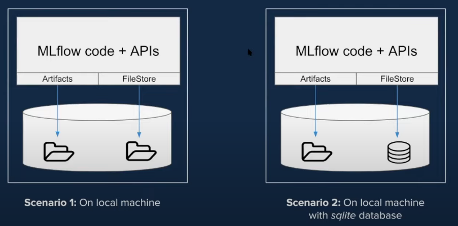
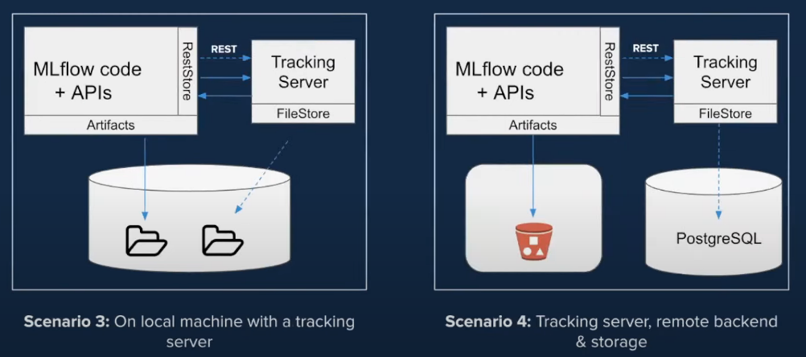
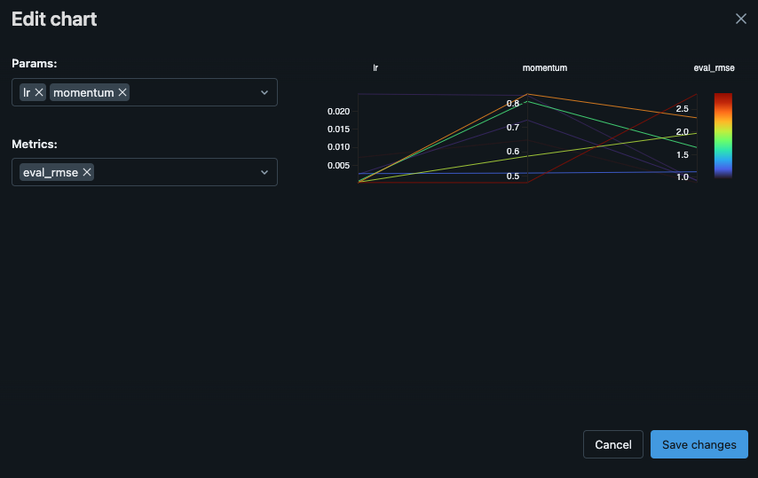

# Introduction
## Definition
MLflow is an open source platform for managing machine learning models life cycle and workflows. It has been developed by
Databricks and first released in 2018. It is designed to be tool-agnostic and platform-agnostic.

## Objective
It makes easy to track model's development and ensure re-usability and reproducibility of the code. 
In addition, it makes it easy to provision models into production and facilitate the re-training process.

## Components
- **Tracking** - It tracks experiments to record and compare parameters and results
- **Projects** - It packages code to ensure reusability and reproducibility
- **Models** - It provides a standard unit for packaging models
- **Model Registry** - It is a central model store for model versioning and annotations
- **MLflow Deployments for LLMs** - This server, equipped with a set of standardized APIs, streamlines access to both SaaS and OSS LLM models.
- **Evaluate** - Designed for in-depth model analysis, this set of tools facilitates objective model comparison
- **Prompt Engineering UI** - A dedicated environment for prompt engineering
- **Recipes** - Serving as a guide for structuring ML projects

## Terminology
### Run
A run is a collection of parameters, metrics, labels, and artifacts related to the training process of a machine learning model.

### Experiment
An experiment is the basic unit of MLflow organization. All MLflow runs belong to an experiment. 
For each experiment, you can analyze and compare the results of different runs, 
and easily retrieve metadata artifacts for analysis using downstream tools. 
Experiments are maintained on an MLflow tracking server

## MLRuns Folder Structure
- **Trash** - It includes every experiment/runs/artifact that has been deleted
- **0** - It is the default experiment folder, unless an experiment name has been specified
- **Other Folders** - They are the experiment folders

# MLflow Tracking
## Definition
It allows to record machine learning model training sessions 
(e.g., code version, hyperparameters, metrics, etc.) and allows to query them.

It allows to track everything in order to reproduce that exact same experiment.

It is composed by an API and a user interface component.

## Logging Functions
- **set_tracking_uri()** - It sets the path to the storage location for tracking information (Default is the local `mlruns` folder)
- **get_tracking_uri()**
- **log_model()** - It tracks the trained model
```python
mlflow.tensorflow.log_model(model, "model", signature=signature)
```

## Tracking Components
- **Source** - It can be the name of the file that launches the run. 
If using MLflow project, it can be the name of the project and the entry point of the run
- **Code Version** - In MLflow project, it's the Git commit hash
- **Parameters** - Key-value input parameters that you want to track
- **Artifacts** - They are output files like images, models (pickle) or parquet files
- **Start and End Time**
- **Metrics** - Key-value metrics containing numeric values. It allows to visualise the full history of each metric.

## Storage Solution
The MLflow Runs information can be recorded into one of these options:
- Local file s
- SQL or SQLlite database
- Into a remote tracking server

MLflow uses two components for storing such information:
- **Back-end Store/FileStore** - It contains entities such as Run details, Run ID, Run Parameters, Run Metrics, etc.
- **Artifact Store** - Artifacts are elements like images, pickle models file, in-memory objects, etc.
Let's see different options for storing the **FileStore** and the **Artifacts**:




The most common solution for storing Artifacts is a Datalake such as AWS S3 or Google Cloud Storage.

## Tracking UI
It allows to visualise, compare and search runs. Additionally, it lets you download metadata or artifacts for runs, 
which you can input for analysis in other tools. MLflow logs information about runs in a `mlruns` directory; 
in order to view the data, you can run the MLflow UI one directory above the `mlruns` folder.

To open the Tracking UI run:
```bash
mlflow server --host 127.0.0.1 --port 8080
```

Notable features of the tracking UI include listing and comparison of runs by experiments, 
and downloading the results of your runs. Additionally, you can search runs by metric value or parameters, 
as well as visualize metrics of each run.

### Nested Runs for Hyperparameters Tuning with Hyperopt
It is possible to create a Run containing other runs. This is particularly useful in case of Hyperparameters Tuning,
when several trials are done in order to check different parameter combinations. Check the example in 
[MLOps/MLflow/examples/2_hyperparameters_sweep/hyperopt.ipynb](./MLOps/MLflow/examples/2_hyperparameters_sweep/hyperopt.ipynb).

The single "root" Run contains several ones, each representing a hyperparameter trial.
It is possible to compare them through a `Parallel Coordinates`:


After identified the best run, it is possible to click on it and register the model.
Check the section Model Registry for more information.

# MLflow Project
## Definition
It packages code used in data science projects, ensuring it can easily be reused and experiments can be reproduced.

The main element is a `MLproject` file, which is a `YAML` file which describes project environment, parameters and entry points.

It comes with API and a CLI designed to running projects and chaining them together into an ML workflow.

## Properties
- **Name**
- **Environment** - It defines the software environment used to execute the entry points of the project (including library dependencies)
- **Entry Points** - They specify the commands you wanto to run inside the project. At least one entry point has to be defined.

All these properties can be enclosed in a YAML file for the whole MLflow Project.
An example could be:
``` yaml
name: tutorial

conda_env: conda.yaml

entry_points:
  main:
    parameters:
      alpha: {type: float, default: 0.01}
    command: "python model.py {alpha}"
```

## Environments
- **System** - It is possible to run projects directly into the existing system environment. All the dependencies have to
be installed before executing the project.
- **Conda** - It is possible to specify a Conda environment for the project, and it would be activated before the project
code starts running.
- **Docker Container** - The MLflow project can use a Docker image that copies the content of the project into a directory
called `/mlflow/projects/code`. All the code is then executed within the resulting container.

# MLflow Models
## Definition
MLflow models let you package machine learning models in a format supported by many downstream tools, so to provision it quickly.

## Terminology
- **Flavors** - They are the frameworks used to develop a model and that can be immediately interpreted by deployment tools
to understand the model. For example, sklearn, xgboost, etc.

## Metadata
It is possible to add metadata to the model, like:
- **Model Signature** - It defines input and output data schema of the model.
- **Model Input Example**

It is possible to define a YAML file with all the MLflow model information (Favlor, signature, input example) in order to easily
deploy it to Docker, Azure ML or Flask.

# Models Registry
## Definition
MLflow Model Registry provides an API and UI for centrally managing your models and their lifecycle. 
The registry provides model lineage, model versioning, annotations, and stage transitions.

## Stored Features
- **Registered Model** - A registered model is one that has a unique name and metadata, contains model versions and transitional stages, and has a model lineage.
- **Model Version**
- **Model Stage** - They are such as staging, production or archived.
- **Annotations and Descriptions** - It is possible to annotate the model using markdown.

## Register a Model from a Run
Click on the run and select *"Register Model"*.
After given a name, it would be available under the *"Models"* tab.
After the model is registered, it is possible to serve it.

# MLflow Deployments
## Deployed Registered Model
```bash
mlflow models serve -m "models:/<model_name>>/<version>" --port 5002
```

# MLflow Pipelines
## Definition
The development and productionization of machine learning applications are made easier and more standardized by using MLflow Pipelines, 
an opinionated framework for structuring MLOps workflows. 
MLflow Pipelines also make it possible for machine learning engineers and DevOps teams to embed these models into apps 
and release them to production in a seamless manner.
Pipelines are structured as git repositories with YAML-based configuration files and Python code. 
This offers developers a declarative approach to the construction of ML applications, which decreases the amount of boilerplate code.