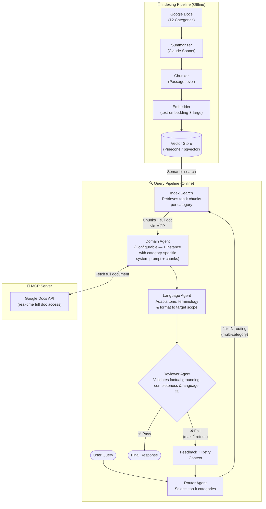

# RFC: AI-Powered Knowledge Base Retrieval System

| Field   | Value          |
| ------- | -------------- |
| Status  | Draft          |
| Author  | Simone Porreca |
| Date    | 2026-04-23     |
| Version | 0.1            |

---

## 1. Scope

Organise and make accessible a personal knowledge base — currently stored as Google Docs across **12 topic categories** — through an AI-powered retrieval interface. The system must allow a user to query the knowledge base in natural language and receive accurate, well-formed answers grounded in the source documents, without requiring manual search or browsing.

---

## 2. Goal

Design and implement a **multi-agent, retrieval-augmented generation (RAG) system** that:

- Indexes the knowledge base semantically, enabling precise retrieval at both document and passage level
- Routes user queries to the correct topic domain(s)
- Generates answers using domain-specific context retrieved from the knowledge base
- Adapts the output language and format to match the scope and audience
- Validates answer quality through a self-correcting review loop before returning a response

---

## 3. Proposed Solution

### 3.1 Overview

The proposed architecture follows a two-pipeline design:

| Pipeline     | Mode    | Role                                                                        |
| ------------ | ------- | --------------------------------------------------------------------------- |
| **Indexing** | Offline | Processes Google Docs into an embedded, searchable vector store             |
| **Query**    | Online  | Routes, retrieves, generates, adapts, and validates answers at request time |

The query pipeline is composed of five sequential agents:

| Stage | Agent          | Role                                                                          |
| ----- | -------------- | ----------------------------------------------------------------------------- |
| 1     | Router Agent   | Classifies query → top-k topic categories                                     |
| 2     | Index Search   | Retrieves relevant chunks from vector store                                   |
| 3     | Domain Agent   | Constructs the answer from retrieved context                                  |
| 4     | Language Agent | Adapts tone, terminology, and format to the target scope                      |
| 5     | Reviewer Agent | Validates factual grounding, completeness, and language fit; triggers retries |

### 3.2 System Diagram

The architecture is composed of two pipelines. The Mermaid source is also available as a standalone file in [`system_diagram.mmd`](./system_diagram.mmd).

### 3.3 High-Level Description

#### 3.3.1 Indexing Pipeline (Offline)

**Step 1 — Summarization**
Each Google Doc is passed to Claude Sonnet in batch mode. The output is a concise summary preserving the document's key concepts, entities, and intent — not its verbatim content. Summaries serve as the **routing signal**: they are embedded and indexed separately from the document's content.

**Step 2 — Chunking**
Each document is also split into passage-level chunks (e.g., 512 tokens, 10% overlap). These chunks are the **retrieval units** — finer-grained than the whole document and preserving specific facts, formulas, or code that summaries would drop.

**Step 3 — Embedding**
Both summaries and chunks are embedded. Two types of vectors are stored:

- Document-level summary vectors — used by the Router Agent to select categories
- Chunk-level vectors — used by the Domain Agent to retrieve specific passages

**Step 4 — Vector Index**
All vectors are stored in a vector database alongside metadata (category, doc ID, chunk ID, Google Docs URL) to support filtered retrieval.

#### 3.3.2 Query Pipeline (Online)

**Step 1 — Router Agent**
A lightweight LLM agent receives the user query and returns a ranked list of relevant categories (1-to-N, not 1-to-1). It searches the summary index to identify which categories likely contain relevant documents. A confidence threshold determines whether 1 or multiple categories are activated.

**Step 2 — Index Search + MCP Access**
For each selected category, the system retrieves the top-k most relevant chunks. The Domain Agent may additionally call the MCP server to fetch the full source document when chunk-level context is insufficient.

**Step 3 — Domain Agent**
A single configurable agent receives:

- A category-specific system prompt (injected at runtime)
- The retrieved chunks as context
- MCP access for full-document retrieval on demand

The agent generates a structured answer grounded in the retrieved content.

**Step 4 — Language Agent**
A dedicated agent wraps the domain agent's output, adapting it to the intended scope. Its responsibilities include:

- Adjusting tone and formality to match the target audience
- Normalising terminology across multi-category answers (avoiding jargon conflicts)
- Formatting the output consistently (e.g., bullet points, code blocks, structured sections)
- Applying scope-specific writing conventions (e.g., conciseness, citation style)

The language agent does not alter factual content — it only transforms how the answer is expressed.

**Step 5 — Reviewer Agent**
A higher-capability agent evaluates the language agent's output against:

- Factual grounding (answer supported by retrieved content)
- Completeness (all aspects of the query addressed)
- Consistency (no contradictions across multi-category answers)
- Language fit (tone and format match the scope defined by the language agent's brief)

On failure, the reviewer returns structured feedback to the Router Agent to trigger a refined retry. A **maximum of 2 retries** is enforced, after which the system returns a best-effort answer with an explicit uncertainty note.

### 3.4 Tech Stack

| Component       | Recommended Tool                           | Alternatives                       |
| --------------- | ------------------------------------------ | ---------------------------------- |
| Document Access | Google Docs API via MCP server             | —                                  |
| Summarization   | Claude Sonnet 4.6 (batch)                  | GPT-4o-mini                        |
| Chunking        | LangChain `RecursiveCharacterTextSplitter` | `unstructured.io`, `chonkie`       |
| Embedding       | OpenAI `text-embedding-3-large`            | Vertex AI `text-embedding-004`     |
| Vector Store    | Pinecone (production)                      | pgvector, Weaviate, ChromaDB (dev) |
| Orchestration   | LangGraph                                  | CrewAI, custom async loop          |
| Router Agent    | Claude Sonnet 4.6                          | GPT-4o                             |
| Domain Agent    | Claude Sonnet 4.6                          | GPT-4o                             |
| Language Agent  | Claude Sonnet 4.6                          | GPT-4o                             |
| Reviewer Agent  | Claude Opus 4.6                            | GPT-4o (with eval prompt)          |
| Index Refresh   | Google Docs webhook → Cloud Function       | Scheduled batch job                |

**Why LangGraph:** The reviewer-triggered retry loop requires a stateful directed graph with cycles. LangGraph models this natively with conditional edges and state persistence across hops.

---

## 4. Risks and Mitigations

| Risk                                                                                                        | Severity | Likelihood | Mitigation                                                                                                            |
| ----------------------------------------------------------------------------------------------------------- | -------- | ---------- | --------------------------------------------------------------------------------------------------------------------- |
| **Summary information loss** — summaries drop specific facts, formulas, or code snippets needed for answers | High     | High       | Chunk-level indexing alongside summaries; summaries used only for routing, chunks for answer generation               |
| **1-to-1 routing failure** — cross-domain queries spanning 2+ categories are misrouted                      | High     | Medium     | Router returns a ranked top-k category list; threshold-based multi-category activation                                |
| **12 specialized agents — maintenance overhead** — separate prompt tuning per category; costly to extend    | Medium   | High       | Single configurable domain agent receiving category-specific system prompt at runtime                                 |
| **Unbounded reviewer loop** — repeated failures cause infinite retries and cost spiral                      | High     | Medium     | Hard cap at 2 retries; best-effort answer with uncertainty flag on third failure                                      |
| **Index staleness** — Google Docs updated after indexing diverge from the vector store                      | Medium   | High       | Refresh pipeline triggered by Google Docs change events (webhook) or nightly scheduled batch re-embedding             |
| **MCP latency** — fetching full docs on every agent call adds I/O overhead                                  | Low      | Medium     | In-session doc cache; fetch only when chunk context is insufficient                                                   |
| **Retrieval precision on long documents** — broad summary vector poorly represents a 50-page doc            | Medium   | Medium     | Hierarchical RAG: route on summary, retrieve on chunks; max doc length thresholds                                     |
| **Multi-category answer coherence** — parallel domain outputs may contradict each other                     | Medium   | Low        | Reviewer checks cross-category consistency; synthesizer step before language agent if needed                          |
| **Language agent overreach** — agent rewrites factual content while adapting tone                           | Medium   | Low        | Language agent receives explicit brief: adapt form, not substance; reviewer checks factual consistency against chunks |

---

## 5. Milestones Roadmap

| Phase                     | Milestone                    | Deliverables                                                                                    | Estimated Duration |
| ------------------------- | ---------------------------- | ----------------------------------------------------------------------------------------------- | ------------------ |
| **0 — Discovery**         | Knowledge base audit         | Category taxonomy validated; doc inventory; tech stack provisioned                              | 1 week             |
| **1 — Indexing Pipeline** | Offline pipeline operational | Summarization, chunking, embedding, vector store populated for all 12 categories                | 3 weeks            |
| **2 — Query MVP**         | Basic retrieval working      | Router Agent + Index Search + Domain Agent; end-to-end query flow without language/review layer | 3 weeks            |
| **3 — Language & Review** | Full agent pipeline          | Language Agent + Reviewer Agent integrated; retry loop with max-cap enforced                    | 2 weeks            |
| **4 — MCP Integration**   | Live document access         | Google Docs API via MCP server; Domain Agent fetches full docs on demand                        | 2 weeks            |
| **5 — Hardening**         | Production-ready             | Index refresh pipeline; observability (tracing, latency, cost tracking); error handling         | 2 weeks            |
| **6 — Evaluation**        | Quality benchmarking         | Retrieval precision/recall benchmarks; end-to-end answer quality scoring; tuning                | 1 week             |

**Total estimated duration: ~14 weeks** from kickoff to production-ready system.

---

## 6. Cost Estimations

Costs are broken into two categories: **one-time indexing costs** (paid once, then on each index refresh) and **per-query inference costs** (paid at runtime).

### 6.1 Assumptions

| Parameter               | Value                       |
| ----------------------- | --------------------------- |
| Number of documents     | ~300 (across 12 categories) |
| Average document length | ~3,000 tokens               |
| Chunks per document     | ~6 (512-token chunks)       |
| Summary length          | ~400 tokens                 |
| Total chunk tokens      | ~5.4M                       |
| Total summary tokens    | ~120K                       |

### 6.2 One-Time Indexing Costs

| Operation                      | Model / Service                          | Estimated Cost |
| ------------------------------ | ---------------------------------------- | -------------- |
| Summarization (input)          | Claude Sonnet 4.6 — $3/1M tokens         | ~$0.90         |
| Summarization (output)         | Claude Sonnet 4.6 — $15/1M tokens        | ~$1.80         |
| Embedding (chunks + summaries) | text-embedding-3-large — $0.13/1M tokens | ~$0.72         |
| **One-time total**             |                                          | **~$3.50**     |

Index refresh cost (partial, triggered by doc updates): estimated **$0.10–0.50 per refresh cycle**.

### 6.3 Per-Query Inference Costs

| Agent                          | Model      | Avg Tokens (in/out) | Cost per Query |
| ------------------------------ | ---------- | ------------------- | -------------- |
| Router Agent                   | Sonnet 4.6 | 500 / 100           | ~$0.003        |
| Domain Agent                   | Sonnet 4.6 | 5,000 / 1,000       | ~$0.030        |
| Language Agent                 | Sonnet 4.6 | 1,500 / 500         | ~$0.012        |
| Reviewer Agent                 | Opus 4.6   | 2,000 / 300         | ~$0.037        |
| **Total per query (no retry)** |            |                     | **~$0.082**    |
| **Total per query (1 retry)**  |            |                     | **~$0.164**    |

### 6.4 Monthly Cost Scenarios

| Scenario                                 | Query Volume      | Vector Store                   | Monthly Infra | Monthly Inference | **Total / Month** |
| ---------------------------------------- | ----------------- | ------------------------------ | ------------- | ----------------- | ----------------- |
| **Prototype** (local dev, low volume)    | 100 queries/mo    | ChromaDB (free, local)         | ~$0           | ~$10              | **~$10**          |
| **Production MVP** (cloud, personal use) | 500 queries/mo    | Pinecone Starter ($70/mo)      | ~$70          | ~$50              | **~$120**         |
| **Team use** (shared, medium volume)     | 3,000 queries/mo  | Pinecone Standard ($120/mo)    | ~$150         | ~$300             | **~$450**         |
| **Enterprise** (high volume, SLAs)       | 15,000 queries/mo | Pinecone Enterprise (~$500/mo) | ~$700         | ~$1,500           | **~$2,200**       |

> Costs are estimates based on April 2026 public pricing. Retry frequency, document corpus growth, and model pricing changes will affect actuals.

---
