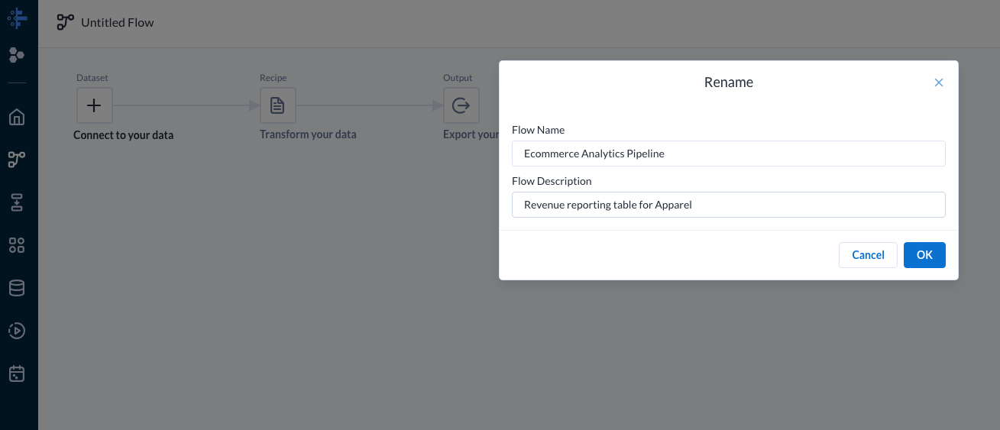
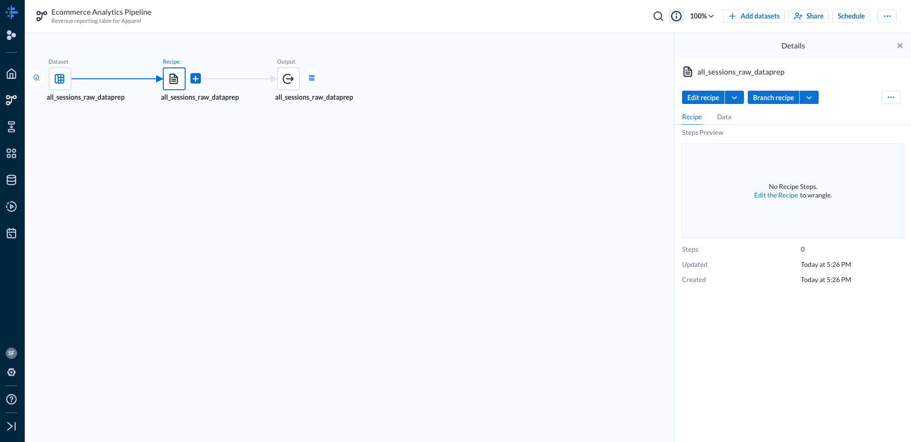
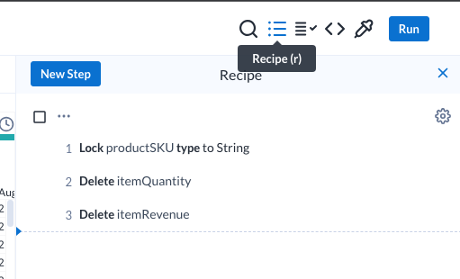
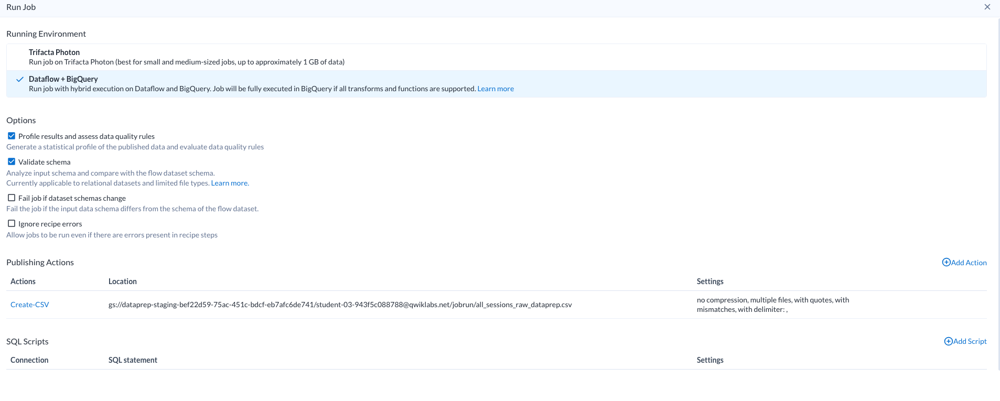
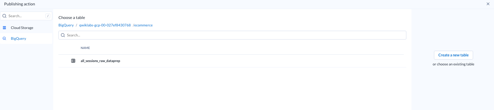

# Flow
## Requirements
You might need granting access to Google Cloud Platform in order to use Dataprep.

## Create
Click on `New Flow` and then on `Untitled Flow` to rename it.

Then select the `+` on `Connect your data` to add a new dataset.
Click on `BigQuery` to the right side and select the dataset you need.
To have a look at the data, click on `Edit Recipe`.

By clicking on the arrow near a column name, you can change the type and doing some other basic data transformation operations.
Each of these operations is called `Step`. The steps can be viewed on the right side of the screen, by clicking on `recipe`.

You can add steps by clicking on the `New Step` on the right side of the screen or add step manually from each column.

## Run
Once you're satisfied with the result, you can run the flow by clicking on `Run` on the top right corner of the screen.

By hovering the mouse on the `Create-CSV` text, you can select the `Edit` option to rchange the publishing destination.

By selecting `BigQuery`, you can choose the dataset and then click on `Create new Table`.

Finally, you can run the job and see it's execution from the `Job History` tab.
