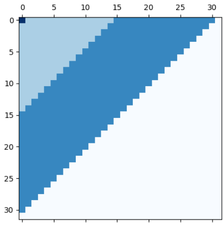

# Introduction

# Process

## Compute Frequency Bands
The resulting `matrix_indices` is shown in the following image:

Starting from the top-left corner and going to the bottom-right one, we have the following values:
- 3
- 1
- 2