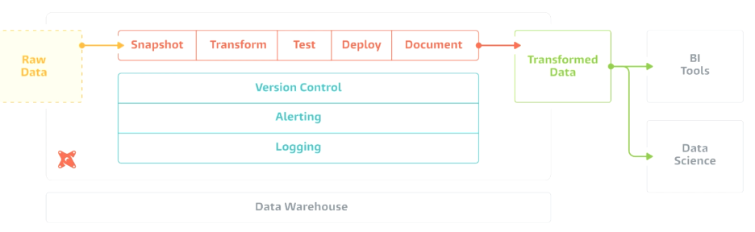
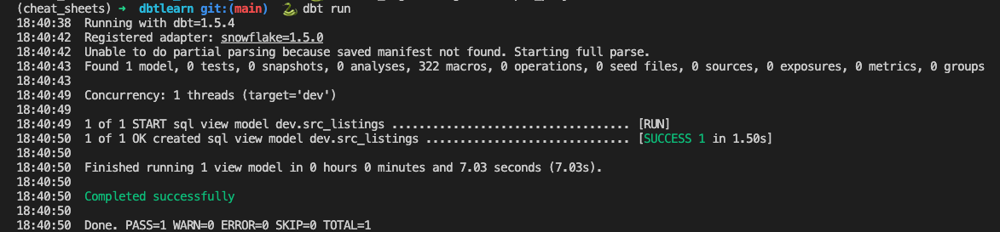
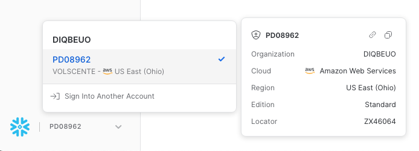

# Introduction
## Installation
```bash
pip install dbt-snowflake==1.5.0
```
## Configuration
You should have a `.dbt` in your home directory.
## Overview
Following the ELT principle, the data transformation happens inside the DWH through several steps that allows easily 
debugging the whole process.

## Components
### Models
They are the basic building blocks of DBT. They are materialized as tables or views and are located in the `models` folder as SQL files. They can also refer each other and use templates and macros.
#### Common Table Expression (CTE)
They are temporary named result and have a form like:
```sql
WITH <name_cte> (
    [column_names]
) AS 
(
    <cte_query>
)
```
Models created under the `models` folder can be structured in subfolders, refelecting the layer which they belong to (e.g., `src` for the Staging Layer, etc.).
Once a model is created, use the following command (`dbt run`) to create the corresponding view in the schema selected:

### Materialisation
#### Definition
It defines how models are stored and managed within the DWH. It is related to the *Core Layer* in the Data Flow. There are four different types of Materialisation:
- **View** - It is the default one and the model is represented as a View. It's good when you don't read the data too often, because the view is executed everytime.
- **Table** - The model is saved as a table and, everytime the DBT flow run, the table is re-created. It's good when you read the data often.
- **Incremental** - It is based on *Fact Tables* and it is used when you do not want to update the historical records. It appends data to a table.
- **Ephemeral** - It does not create anything in the DWH. It is used to exclude some views or tables from the final ones.

#### Configuration
In order to specify the default materialisation type among the above ones, go to the `dbt_project.yml` file and add the following lines:
```yml
models:
  dbtlearn:
    +materialized: view # Default materialisation type is 'view'
    dim:
        +materialized: table # Models inside 'models/dim' folder are materialized as 'table'
```
**NOTE:** Don't forget to execute `dbt run` after such changes.

#### View Materialisation
It can be set in the `dbt_project.yml` as the default one through:
```yml
models:
  dbtlearn:
    +materialized: view
```
or it can be set in the model definition by adding at the top:
```sql
{{
    config(
        materialized = 'view'
    )
}}
```

#### Table Materialisation
In order to create a  materialisation, create the corresponding model under the `models/dim` folder. Afterwards, run the command `dbt run`.

#### Incremental Materialisation
If you want to have an incremental materialisation, create the model under the `models/fct` folder and add the following configuration at the top:
```sql
{{
    config(
        materialized = 'incremental',
        on_schema_change='fail' -- What happen if the schema chages
    )
}}
```
It is also required to specify how DBT has to increment the table through a Jinga if statement like:
```sql
 -- If this is an incremental load (i.e. not creating table)
    AND review_date > (select max(review_date) from {{ this }}) -- Append this condition for incremental records

```

Once a new record is inserted into the *Raw Layer*, it is possible to increment the materialised model by executing `dbt run`. To re-create the incremental materialization table from zero, use: `dbt run --full-refresh`.

#### Ephemeral Materialisation
Set the models you want to be ephemeral (a.k.a. excluded from the final tables) in the `dbt_project.yml`. For example every models inside the `src` folder:
```yaml
models:
  dbtlearn:
    +materialized: view
    dim:
      +materialized: table
    src:
      +materialized: ephemeral
```
In this way, when running `dbt run`, the models inside `src` folder won't be created. They become CTEs.
### Sources and Seeds
#### Sources
They are data already inside the DWH and usually are constructed upon the Raw Layer. They give more information about the freshness of the data.

They are defined in a `sources.yml` file, located in the `models` folder. It maps each raw table to a source table. For example:
```yaml
version: 2

sources:
  - name: airbnb
    schema: raw
    tables:
      - name: listings # this is the mapped name in the source table
        identifier: raw_listings # this is the name of the table in the raw

      - name: hosts
        identifier: raw_hosts

      - name: reviews
        identifier: raw_reviews
```

Afterwards it is possible to reference raw tables in the models as:
```sql
WITH raw_hosts AS (
    SELECT 
        *
    FROM
        {{ source('airbnb', 'hosts') }}
)
```
instead of:
```sql
WITH raw_hosts AS (
    SELECT 
        *
    FROM
        AIRBNB.RAW.RAW_HOSTS
)
```
This would allow to the raw data to change, even the location, and the above model won't be affected.

Check the correctness of everything through `dbt compile`.

To check the freshness of the data you can specify:
```yml
version: 2

sources:
  - name: airbnb
    schema: raw
    tables:
      - name: listings # this is the mapped name in the source table
        identifier: raw_listings # this is the name of the table in the raw

      - name: hosts
        identifier: raw_hosts

      - name: reviews
        identifier: raw_reviews
        loaded_at_field: date # Interested column
        freshness: # Check the freshness of the data
          warn_after: {count: 1, period: hour} # If the data is older than 1 hour, warn
          error_after: {count: 24, period: hour} # If the data is older than 24 hours, error
```

Through the command `dbt source freshness` you can check if the data are fresh or not. If there are no data older than one hour, you will get a warning. If there are not data older than 24 hours, you will get an error.

#### Seeds
They are data that are not inside the DWH. The *Seed* is the source of such data (e.g. Your local laptop as .CSV files). The folder is defined in the `dbt_project.yml` file as `seed-paths` and usually this path points to the `seeds` folder.

Once the data are located in the `seeds` folder, run the command `dbt seed` to load the data into the DWH. The data are loaded into the `dbtlearn` schema and the table name is the same as the file name. They will be loaded as `table` materialisation. The belongs to the 'Mart' layer.

### Snapshots
They are used to store the state of a table at a given point in time. They are useful to track changes in the data. They are materialised as tables and are located in the `snapshots` folder as SQL files. They implement a Type 2 SCD and thus each snapshot is prefixed by `scd_`.

Once a snapshot is created, you can activate it through the command `dbt snapshot`.

```sql


{{
    config(
        target_schema='dev',
        unique_key='id',
        strategy='timestamp',
        updated_at='updated_at',
        invalidate_hard_deletes=True
    )
}}SELECT * FROM {{ source('airbnb', 'listings') }}

```
The above snapshot called `scd_raw_listings` register the all the data coming from source listings (`SELECT * FROM {{ source('airbnb', 'listings') }}`). Each modified row has the attribute `updated_at` changed to reflect the last version of the row. New columns are added to keep track of such history.

### Test
There *Singular* and *Generic* tests. The first ones are simple SQL queries expected to return an empty result set. While the second ones are built-in tests that can be used to check the data quality. They are defined for each column:
- unique (check if the column has only unique values)
- not-null (check if the column has no null values)
- accepted_values (check if the column has only the specified values)
- relationships (check if the column has a valid relationship with another table)

**NOTE:** A good third-party package for testing is [Great Expectations](https://github.com/great-expectations/great_expectations) and even its [version from DBT](https://github.com/calogica/dbt-expectations)

You can add the tests in the `schema.yml` file as:
```yaml
  - name: dim_listings_w_hosts
    description: Cleansed table which contains AirBnB listings with hosts.
    tests:
      - dbt_expectations.expect_table_row_count_to_equal_other_table:
          compare_model: source('airbnb', 'listings')
```

And then test the single model through the command `dbt test --select dim_listings_w_hosts`.

#### Generic Tests
It requires a new file called `schema.yml` in the `models` folder where to define such generic tests. For example:
```yaml
version: 2

models:
  - name: dim_listings_cleansed
    columns:

      - name: listing_id
        tests:
          - unique
          - not_null

      - name: host_id
        tests:
          - not_null
          - relationships: # host_id should have a key in dim_hosts_cleansed 
              to: ref('dim_hosts_cleansed')
              field: host_id

      - name: room_type
        tests:
        - accepted_values:
            values: 
              - 'Entire home/apt'
              - 'Private room'
              - 'Shared room'
              - 'Hotel room'
```
Once these tests are defined, you can run all of them through the command `dbt test`. Or you can run specific ones through `dbt test --select dim_listings_cleansed` that referred only to a certain model.

If a test fails, the corresponding SQL query would be generated to capture the rows that failed the test.

#### Singular Tests
They are just SQL queries that should return a empty result set. They are defined in the `tests` folder as SQL files. For example:
```sql
-- The minimum number of nights should be at least 1
SELECT
    *
FROM
    {{ ref('dim_listings_cleansed') }}
WHERE
    minimum_nights < 1
LIMIT 10
```

### Macros
They can used, for example, to create a test.
The macros should be defined in the `macros` folder as SQL files. For example:
```sql
-- It will check if there are nulls in the columns of the given model

    SELECT 
        * 
    FROM
         {{ model }} 
    WHERE
        
            {{ col.column }} IS NULL OR
        
        FALSE -- This is to remove the last OR
s
```
And then you can call them in a test from the `tests` folder as:
```sql
{{ no_nulls_in_columns(ref('dim_listings_cleansed')) }}
```

#### Custom Generic Tests
They are macros with a very specific signature at the top named `test`:
```sql
-- The test takes two arguments: model and column_name

SELECT
    *
FROM
    {{ model }}
WHERE
    {{ column_name}} < 1

```

If you want then to add the custom generic test to the list of tests, modify the `schema.yml` file as:
```yaml
- name: minimum_nights
        tests:
          - positive_values
```

### Third-Party Packages
They can be installed from the [DBT Package Hub](https://hub.getdbt.com/) by selecting the package and coping the followin example lines of code into the `packages.yml` (in the DBT Project folder) file:
```yaml
packages:
  - package: dbt-labs/dbt_utils
    version: 1.1.1
```

Afterwards, run the command `dbt deps` to install the package.

### Documentation
It can be defined in the `schema.yml` file as or as standalone markdown files.

The landpage of the documentation is in the `overview.md` file in the `models` folder. Images can be put in the `assets` folder.
**NOTE:** Remember to add such folder in the `dbt_project.yml` file as:
```yaml
asset-paths: ["assets"]
```

#### Simple Documentation
To add a simple documentation in the `schema.yml` file, add the following line in the description and for each column add a description:
```yaml
models:
  - name: dim_listings_cleansed
    description: Cleansed table which contains AirBnB listings.
    columns:

      - name: listing_id
        description: Primary key for the listings.
        tests:
          - unique
          - not_null
```

Once the simple documentation is defined, run the command `dbt docs generate` to generate the documentation as JSON file in the `target/catalog.json` file. Then, run `dbt docs serve` to serve the documentation in the browser.

#### Standalone Documentation
Define a `docs.md` file in the `models` folder and add the following lines:
```markdown

Minimum number of nights required to rent this property.
Keep in mind that old listings might have `minimum_nights` set
to 0 in the source tables. Our cleansing algorithm updates this to `1`.

```

And then add it to the `schema.yml` file as description field in a column:
```yaml
- name: minimum_nights
        description: '{{ doc("dim_listing_cleansed__minimum_nights") }}'
        tests:
          - positive_values
```

#### DAG
It is generated in the bottom-left corner of the documentation page. It shows the dependencies between the models.

### Analyses
They are located in the `analysis` folder and are SQL files. They are used to run ad-hoc queries on the DWH. They are not part of the DBT flow.

They are compiled through the command `dbt compile` and then run in your DWH. The compiled query would be in the `target/compiled/dbtlearn/analyses` folder.

### Hooks
They are SQL queries executed at predifined times during the DBT flow. They are located in the `hooks` folder and are SQL files. They are not part of the DBT flow.

There are four types of hooks:
- `on-run-start` - Executed before the DBT flow starts
- `on-run-end` - Executed after the DBT flow ends
- `pre-hook` - Executed before the DBT flow starts for a specific model
- `post-hook` - Executed after the DBT flow ends for a specific model

**NOTE:** Execute the following query to create the user and the role for Hooks:
```sql
USE ROLE ACCOUNTADMIN;

CREATE ROLE IF NOT EXISTS REPORTER;
CREATE USER IF NOT EXISTS PRESET
 PASSWORD ='presetPassword123'
 LOGIN_NAME ='preset'
 MUST_CHANGE_PASSWORD =FALSE
 DEFAULT_WAREHOUSE ='COMPUTE_WH'
 DEFAULT_ROLE ='REPORTER'
 DEFAULT_NAMESPACE ='AIRBNB.DEV'
 COMMENT ='Preset user for creating reports' ;
 
GRANT ROLE REPORTER TO USER PRESET;
GRANT ROLE REPORTER TO ROLE ACCOUNTADMIN;
GRANT ALL ON WAREHOUSE COMPUTE_WH TO ROLE REPORTER;
GRANT USAGE ON DATABASE AIRBNB TO ROLE REPORTER;
GRANT USAGE ON SCHEMA AIRBNB.DEV TO ROLE REPORTER;
```

Hooks are defined in the `dbt_project.yml` file as:
```yaml
models:
  dbtlearn:
    +materialized: view
    +post-hook:
      - "GRANT SELECT ON {{ this }} TO ROLE REPORTER"
    dim:
      +materialized: table
    src:
      +materialized: ephemeral
```

This post-hook would grant the `REPORTER` role the permission to read the model `dbtlearn` after it is created. It would be executed after the model is created (`dbt run`).

# CLI
## Prompt
```bash
dbt
```
## Init Project
```bash
dbt init <project_name>
```
**NOTE:** You will need your user-organization information, you can find them in the bottom left corner of DBT (`DIQBEUO-PD08962`)

**NOTE 2:** The username and password are the ones setup on the DWH, not of Snowflake!
The command will create a `profile.yml` file inside the `~/.dbt` folder.
**NOTE 3:** In the file `<project_name>.yml` delete the example lines in the `models/<project_name>`
**NOTE 4:** Delete the example files under the `models` folder.
## Debug
```bash
# From inside the DBT Project, execute the command to check the connection
dbt debug
```
## Compile
```bash
# From inside the DBT Project, execute the command to check if every model is correct
dbt compile
```