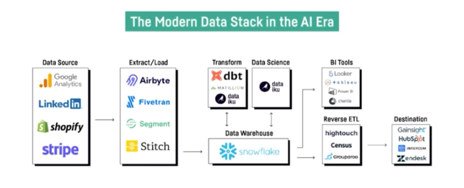
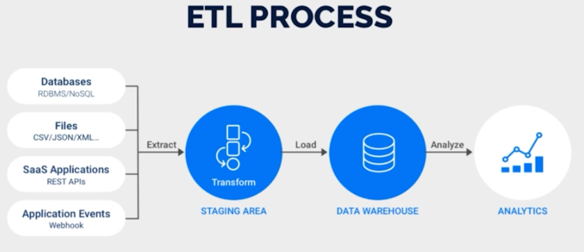
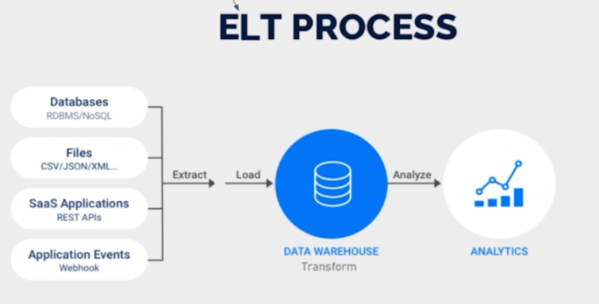
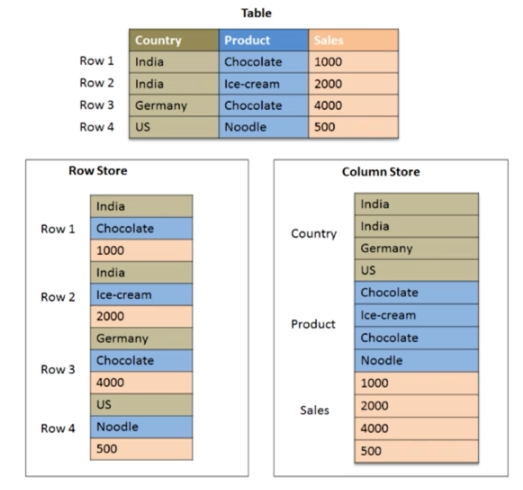
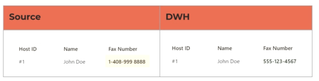
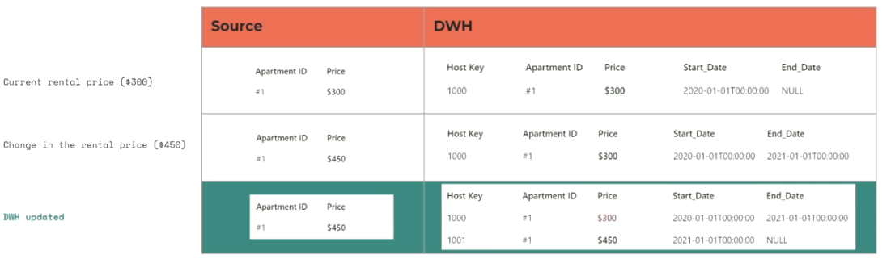
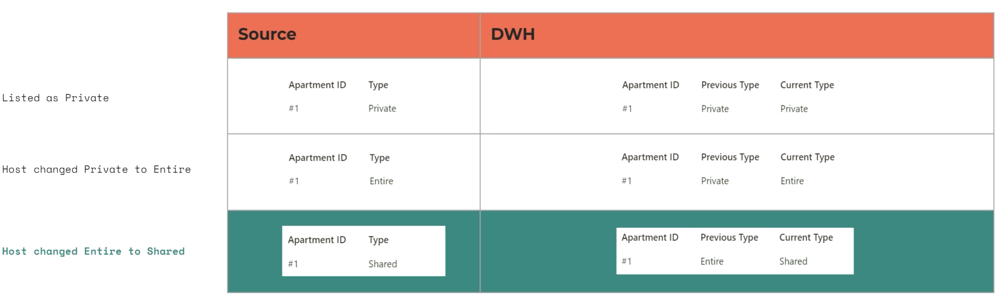

# Data Management
## Data Characteristics (The 3 Vs)
- Variety - How different are data
- Velocity - How fast data should be ingested
- Volume - How much data
## Data Area Hierarchy
1. **Data Collection** - Extract data from several sources in different formats
2. **Data Wrangling** - Improve the data quality (clean data, handle missing values, address inconsistent data, etc.)
3. **Data Integration** - Load data into a sink destination
4. **BI and Analytics**
5. **Machine Learning**

## ETL vs ELT
The first three steps of the Data Area Hierarchy can be associated to the **ETL Process** (Extract, Transform and Load).
This approach was initially designed so that the transformation step takes place outside the database. That was due to
resource constraints.
However, right now the data storage resources are really powerful, and it is now preferable the **ELT Process**.
In here the transformations happen inside the database, since the computational power is so high that there is not the need
anymore to do the transformations elsewhere. 

## Row-Oriented vs Column-Oriented Databases
The Row-Oriented Databases store each row independently. It is still pretty used in traditiona DBMS like PostgreSQL or MySQL.
However, for BI and Reporting purposes, Column-Oriented Databases work much better, since they store the values at a column level.
Suppose you want to aggregate the sales from the 'Sales' column, with a Row-Oriented Database you need to load the whole table.
While with a Column-Oriented Database you just need to load the 'Sales' column.

# Data Warehouse (DWH)
## Definition
It acts as the source of truth for Data Analytics and Data Reporting teams. They are not designed for unstructured data.
Here is the destination of an ETL/ELT process.
## Technologies
- AWS Redshift
- Google BigQuery
- Snowflake
# Data Lake
## Definition
It is the place where to store unstructured or semi-structured data. Also raw data are here. It's like a repository where to
put different kind of data.
It is a very scalable data storage.
## Technologies
- AWS S3
# Data Lakehouse
## Definition
It combines characteristics from Data Warehouse and Data Lake: there is a layer of structured and organised data that sits 
on top of a low-cost Data Lake. There is a Metadata and Governance Layer which makes the data in the underneath data lake 
ready for BI, Reports and Machine Learning applications.
# Slowly Changing Dimensions (SCD)
## Definition
It deals with how data changes over time within a data warehouse or database. 
In real-world scenarios, data in business applications often undergoes changes, such as updates, inserts, or deletions. 
Slowly Changing Dimensions provide a standardized approach to handle such changes efficiently and systematically 
while preserving historical data.
## Types
They are strategies on how to implement SCD.
### Type 0 - Retain Original
The change is not transmitted into the DWH. It is used when the dimension (a.k.a. the attribute) is not used anymore 
(like the fax number).

### Type 1 - Overwrite
The change is written both in the original data and transmitted to the DWH. Lost the original value.
### Type 2 - Add New Row
In order to keep the history with respect to type 1, add another row.

The history is kept, but number of rows might grow exponentially. Processing speed is affected.
### Type 3 - Add New Attribute
It does keep just partial history: original and current value. It saves the processing speed.

## Data Flow Overview
1. Raw Data
2. SCD Data
3. Dim Data
4. Final Tables
5. Dashboards