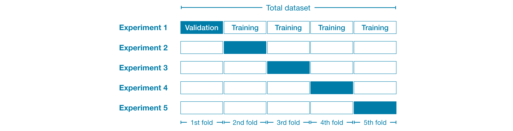

# Introduction

## Definition
In cross-validation, we run our modeling process on different subsets of the data 
to get multiple measures of model quality.

For example, we could begin by dividing the data into 5 pieces, each 20% of the full dataset. In this case, 
we say that we have broken the data into 5 "folds".

Cross-validation gives a more accurate measure of model quality, 
which is especially important if you are making a lot of modeling decisions. 
However, it can take longer to run, because it estimates multiple models 
(one for each fold).

So, given these tradeoffs, when should you use each approach?

- For small datasets, where extra computational burden isn't a big deal, you should run cross-validation.
- For larger datasets, a single validation set is sufficient. Y
Your code will run faster, and you may have enough data that there's little need to re-use some of it for holdout.




# Code

## Cross-Validation Score
``` python
# Compute the Cross-Validation score
cross_validation_score = cross_val_score(my_pipeline, X, y, cv=5, scoring='mae').mean()
```
It is good to plot the cross-validation value across different hyperparameter' values 
(e.g., across different number of estimators of a Random Forest)