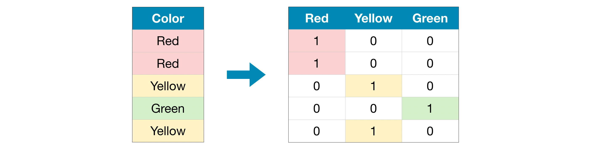

# Cleaning Outliers

## Interquartile Range (IQR)

``` python
# Define the list of columns for which compute the IQR
iqr_columns = ['Year_Birth', 
               'Income', 
               'MntWines', 
               'MntFruits', 
               'MntMeatProducts', 
               'MntFishProducts', 
               'MntSweetProducts', 
               'MntGoldProds', 
               'NumDealsPurchases', 
               'NumWebPurchases',
               'NumCatalogPurchases', 
               'NumWebVisitsMonth']

# Compute Q1 and Q3
q1 = data[iqr_columns].quantile(0.25)
q3 = data[iqr_columns].quantile(0.75)

# Compute the IQR
iqr = q3 - q1

# Compute the lower and upper filtering bounds
lower_filtering_bound = q1 - 1.5*iqr
upper_filtering_bound = q3 + 1.5*iqr

# Filter outliers
data_cleaned_outliers = data[~((data[iqr_columns] < lower_filtering_bound) |(data[iqr_columns] > upper_filtering_bound)).any(axis=1)].reset_index(drop=True)
```

# Fill NaN Values

## Drop Columns

``` python
# Get names of columns with missing values
nan_columns_count = (data.isnull().sum())
nan_column_names = nan_columns_count[nan_columns_count > 0].index.tolist()

# Drop columns in training and validation data
reduced_data = data.drop(nan_column_names, axis=1)
```

## Imputation
Next, we use SimpleImputer to replace missing values with the mean value along each column.

Although it's simple, filling in the mean value generally performs quite well (but this varies by dataset).
While statisticians have experimented with more complex ways to determine imputed values (such as regression imputation,
for instance), the complex strategies typically give no additional benefit once you plug the results into sophisticated 
machine learning models.

Fit the imputer only on the training data.
``` python
from sklearn.impute import SimpleImputer

# Imputation
my_imputer = SimpleImputer()
imputed_X_train = pd.DataFrame(my_imputer.fit_transform(X_train))
imputed_X_valid = pd.DataFrame(my_imputer.transform(X_valid))

# Imputation removed column names; put them back
imputed_X_train.columns = X_train.columns
imputed_X_valid.columns = X_valid.columns
```

# Categorical Variables
The number of categories of each variable is called **Cardinality**.

## Ordinal Encoding
This approach assumes an ordering of the categories.


``` python
from sklearn.preprocessing import OrdinalEncoder

# Make copy to avoid changing original data 
label_X_train = X_train.copy()
label_X_valid = X_valid.copy()

# Apply ordinal encoder to each column with categorical data
ordinal_encoder = OrdinalEncoder()
label_X_train[object_cols] = ordinal_encoder.fit_transform(X_train[object_cols])
label_X_valid[object_cols] = ordinal_encoder.transform(X_valid[object_cols])
```

## One-Hot Encoding
Categories are not ordered. This approach can increase a lot the dataset's size.


``` python
from sklearn.preprocessing import OneHotEncoder

# Apply one-hot encoder to each column with categorical data
OH_encoder = OneHotEncoder(handle_unknown='ignore', sparse=False)
OH_cols_train = pd.DataFrame(OH_encoder.fit_transform(X_train[object_cols]))
OH_cols_valid = pd.DataFrame(OH_encoder.transform(X_valid[object_cols]))

# One-hot encoding removed index; put it back
OH_cols_train.index = X_train.index
OH_cols_valid.index = X_valid.index

# Remove categorical columns (will replace with one-hot encoding)
num_X_train = X_train.drop(object_cols, axis=1)
num_X_valid = X_valid.drop(object_cols, axis=1)

# Add one-hot encoded columns to numerical features
OH_X_train = pd.concat([num_X_train, OH_cols_train], axis=1)
OH_X_valid = pd.concat([num_X_valid, OH_cols_valid], axis=1)
```

## Comparison
Use the Ordinal Encoding when the cardinality of the variable is high, otherwise use the One-Hot Encoding.


## Utils

### Get Categorical Variables
``` python
# Get list of categorical variables
object_cols = [col for col in X_train.columns if X_train[col].dtype == "object"]
```

### Check Columns for Ordinal Encoding
Check if the categorical variables can be encoded (i.e., if the categories are the same between training and test set)
``` python
# Columns that can be safely ordinal encoded
good_label_cols = [col for col in object_cols if 
                   set(X_valid[col]).issubset(set(X_train[col]))]
        
# Problematic columns that will be dropped from the dataset
bad_label_cols = list(set(object_cols)-set(good_label_cols))
```

### Check Columns for One-Hot Encoding
``` python
# Columns that will be one-hot encoded
low_cardinality_cols = [col for col in object_cols if X_train[col].nunique() < 10]

# Columns that will be dropped from the dataset
high_cardinality_cols = list(set(object_cols)-set(low_cardinality_cols))
```

