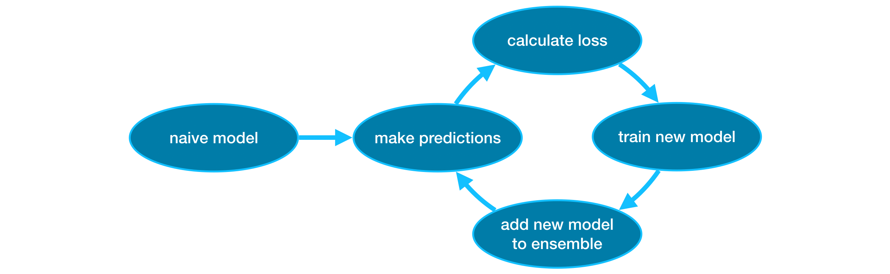

# Theory

## Definition
It is an ensemble method, which combines the predictions of several models, that is called "Gradient Boosting".

## Process
Gradient boosting is a method that goes through cycles to iteratively add models into an ensemble.

It begins by initializing the ensemble with a single model, whose predictions can be pretty naive.

Then, we start the cycle:

- First, we use the current ensemble to generate predictions for each observation in the dataset. 
To make a prediction, we add the predictions from all models in the ensemble.
- These predictions are used to calculate a loss function (like mean squared error, for instance).
- Then, we use the loss function to fit a new model that will be added to the ensemble. Specifically, 
we determine model parameters so that adding this new model to the ensemble will reduce the loss. 
(Side note: The "gradient" in "gradient boosting" refers to the fact that we'll use gradient descent on 
the loss function to determine the parameters in this new model.)
- Finally, we add the new model to ensemble, and ...
- ... repeat!



## Parameters

### n_estimators
It specifies how many times to go through the modeling cycle described above. 
It is equal to the number of models that we include in the ensemble.

- Too low a value causes underfitting, which leads to inaccurate predictions on both training data and test data.
- Too high a value causes overfitting, which causes accurate predictions on training data, 
but inaccurate predictions on test data (which is what we care about).

Typical values range from 100-1000, though this depends a lot on the **learning_rate**.

### early_stopping_rounds
Early stopping causes the model to stop iterating when the validation score stops improving, even if we aren't at 
the hard stop for `n_estimators`. It's smart to set a high value for n_estimators and then use `early_stopping_rounds` 
to find the optimal time to stop iterating.

Setting `early_stopping_rounds=5` is a reasonable choice. 
In this case, we stop after 5 straight rounds of deteriorating validation scores.

When using `early_stopping_rounds`, you also need to set aside some data for calculating the validation scores - 
this is done by setting the `eval_set` parameter.

``` python
my_model = XGBRegressor(n_estimators=500)
my_model.fit(X_train, y_train, 
             early_stopping_rounds=5, 
             eval_set=[(X_valid, y_valid)],
             verbose=False)
```

If you later want to fit a model with all of your data, 
set `n_estimators` to whatever value you found to be optimal when run with early stopping.

### learning_rate
Instead of getting predictions by simply adding up the predictions from each component model,
we can multiply the predictions from each model by a small number (known as the **learning rate**) before adding them in.

This means each tree we add to the ensemble helps us less. So, we can set a higher value for `n_estimators` without 
overfitting. If we use early stopping, the appropriate number of trees will be determined automatically.

In general, a small learning rate and large number of estimators will yield more accurate XGBoost models, 
though it will also take the model longer to train since it does more iterations through the cycle. As default, 
XGBoost sets `learning_rate=0.1`.

``` python
my_model = XGBRegressor(n_estimators=1000, learning_rate=0.05)
my_model.fit(X_train, y_train, 
             early_stopping_rounds=5, 
             eval_set=[(X_valid, y_valid)], 
             verbose=False)
```