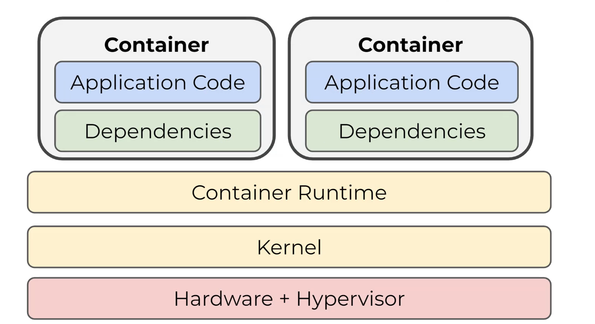

# Containers
## Definition
A container is a standard unit of software that packages up code and all its dependencies so the application runs quickly and reliably from one computing environment to another.

## Permissions
- **Namespaces** - They define what a proicess can see
- **Cgroups** - They define what a process can use

## Technologies
### Docker
Docker provides the ability to package and run an application in a loosely isolated environment called a container.