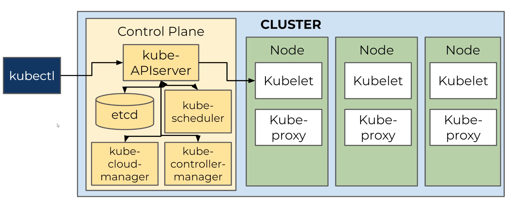

# Introduction
## Definition
It is a portable, extensible, open-source platform for managing containerised workloads and services. It is most commonly referred as a **Container Orchestrator**.

### Containers vs VMs
A virtual machine is a complete Operating System that runs over an hardware. The hardware resources are, however, virtualised, so that the VM can only access a portion of them and not the whole.

A Container, however, is a higher level of abstraction that relies on the exact same Kernel as the machine is running upon, without the need of having a complete Operating System.


## History
It was originally designed by Google and then open-sourced thanks to the *Cloud Native Computing Foundation* in 2015.

The concept and the need of Container Orchestrators, like Kubernetes, came afterwards the so called *Monoliths* applications, in which all the components were integrated into a single deployable artifact. Such an approach presented quite few drawbacks:
- Hard to scale
- Slow to deploy
- Costly to maintain

In order to solve such issues, the so called *Microservices* approach was launched. It defines a new system design, in which each piece lives as its own individually and independent artifact. Such design ensures:
- Easy to scale
- Fast to deploy just the needed service
- Cheap to maintain

However, maintaining a single VM for each service was not efficient. That's why the *Containerised Approach* was invented. The main challenge was to:
- How to coordinate several containers living within the same application?
- How to let these containers communicate between each other?
- How to ensure no downtime while updating or fixing a container?

Containeer Orchestrators, like Kubernetes, were born in order to solve such questions.

# Clusters
## Definition
Kubernetes works in terms of *Clusters*: a collection of *Nodes*, which are composed by one or more *PODs*, which are composed by *Containers*.

In GCP, you can create a cluster with:
```bash
gcloud container clusters create-auto <name_of_clsuter> --location=us-central1
```

## Nodes
They contain everything necessary to run PODs:
- Container Runtime (To run containers)
- Kubelet (Run necessary k8s processes)
- Kube-proxy (Handle networking for Kubernetes API)

Cluster &rarr; Node &rarr; PODs &rarr; Containers

## PODs
They host the container application, which can be deployed through:
```bash
kubectl create deplyment <name> --image <image>
```

**NOTE:** It is also possible to specify the number of replicas that has to spread across different nodes.

Then we need to expose the service:
```bash
kubectl expose deployment <name> --port 80 --type LoadBalancer --target-port 8080
```

## Control Plane & Desired State
They in which Kubernetes ensure that the cluster is running correctly is to use a *Control Plane* in order to manage the containers within the cluster. The state of such machines has to match a pre-defined *Desired State*.

The **Control Plane** includes several controllers:
- API Server - It receives and executes commands from the below elements
- Etcd - It holds important key-value information for k8s
- Scheduler - It organises the PODs inside the nodes
- Controller Manager - It it responsible for the lifecycle management of PODs (it is responsible for checking the match between the current cluster state and the desired one)
- Cloud Controller - It is used to integrate with Cloud providers, such as GCP

On the PODs we have:
- Kubelet - It is used for communication between Kube API Server and PODs
- Kubeproxy - It is used to maintain the network between the cluster's PODs



# Kubernetes API
## Definition
It is a practical way used to communicate commands and instructions for Kubernetes. It both works in an *Imperative* approach, writing commands and execute them, or *Declarative*, create a file for the Kubernetes API to read the commands from.

## Deployment Objects
Kubernetes deployment objects are persistent entities in the Kubernetes system. Kubernetes uses these entities to represent the state of your cluster. Specifically, they can describe:
- What containerized applications are running (and on which nodes)
- The resources available to those applications
- The policies around how those applications behave, such as restart policies, upgrades, and fault-tolerance

```yaml
apiVersion: apps/v1
kind: Deployment
metadata:
  name: nginx-deployment
spec:
  selector:
    matchLabels:
      app: nginx
  replicas: 2 # tells deployment to run 2 pods matching the template
  template:
    metadata:
      labels:
        app: nginx
    spec:
      containers:
      - name: nginx
        image: nginx:1.14.2
        ports:
        - containerPort: 80
```

## Manage Deployment Objects
They can be scaled, also automatically through:

`kubectl autoscale deployment <name> --min=1 --max=4 --cpu-percent=90`

Another option is to use the **Apply** command to change the deployment based on a file:

```bash
# Remember to retrieve first the cluster credentials
kubectl apply -g <deployment_file>.yaml
```

Or use the commands **Set** and **Rollout**:
```bash
# Set the new image
kubectl set image <deployment_name> <container_name>=<image_name>

# Rollout the change
kubectl rollout status <deployment_name>
```

### Deployment Stragegies
They define how to update an existing deployment with an update version.
1. **Blue-Green Deployment** - A replica of the current deployment is made an tested in a separated environment. Once it's fully operational and tested, it is switched with the previous one. The main advantage is that the switch is instant, the problem is that is requires double the resources for maintaining both the blue and green environments.
2. **Canary Deployment** - The new version is only released to a subset of users and gradually rolled-out to others. It is very flexible and also allows to collect feedback. However, it is very time consuming.
 
## Kubectl
It is the CLI of K8s that allows to directly communicate with the Kubernetes API Server.

Information about credentials and location of the Kubernetes Cluster can be found udner `$HOME/.kube/config`.

# Google Cloud Platform
## Services
### Google Build
It is used in order to build container images:
```bash
# Syntax
gcloud builds submit --region=<region> --tag gcr.io/<project_ID>/<image_name> .

# Example
gcloud builds submit --region=us-west2 --tag gcr.io/test_project_id/image_1 .
```

It is also possible to submit a **Build Configuration** file like:
```yaml
# Example
steps:
- name: 'gcr.io/cloud-builders/docker'
    args: ['build', '-t', 'gcr.io/$PROJECT_ID/helloworld-image', '.']
images:
- 'gcr.io/$PROJECT_ID/helloworld-image'
```

Submit it to Google Build through:
```
gcloud builds submit --config <config_build_file>
```

### Artifact Registry
Images built with **Google Build** are automatically pushed to the Artifact Registry.

### GKE
It offers capabilities to manage Kubernetes Clusters in a Standard (full control) or Autopilot (more automations) ways.

It is possible to easily create a cluster through the GUI and specifies its configuration (e.g., the number of nodes)

After that, click on *Workloads* to create PODs on that cluster.

We can retrieve credentials for a GKE Cluster through:
```bash
gcloud container clusters get-credentials <cluster_name> --zone <zone_name>
```

The above command will automatically update the `$HOME/.kube/config` with the new GKE cluster credentials.

## Deploy a Cluster Deployment on GCP - DEMO
1. Activate GKE API and Artifact Registry on GCP
2. Set default project on gcloud `glocud config set project <PROJECT_ID>`
3. Set default zone `gcloud config set compute/zone <us-west1-a>`
4. Set default region `gcloud config set compute/region <us-west1>`
5. Create GKE cluster `gcloud container clusters create <cluster_name> --num-nodes=1`
6. Get GKE cluster credentials `gcloud container clusters get-credentials <cluster_name>`
7. Create deployment `kubectl create deployment <deployment_name> --image <image_name>`
8. Expose the deployment through a service `kubectl expose deplyment <deployment_name> --type LoadBalancer --port 80 --target-port 8080`
9. Check `kubectl get pods` and `kubectl get service <deployment_name>`