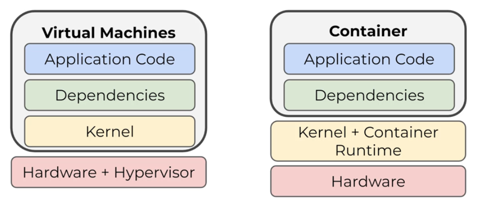

# Introduction
## Definition
It is a portable, extensible, open-source platform for managing containerised workloads and services. It is most commonly referred as a **Container Orchestrator**.

### Containers vs VMs
A virtual machine is a complete Operating System that runs over an hardware. The hardware resources are, however, virtualised, so that the VM can only access a portion of them and not the whole.

A Container, however, is a higher level of abstraction that relies on the exact same Kernel as the machine is running upon, without the need of having a complete Operating System.

## History
It was originally designed by Google and then open-sourced thanks to the *Cloud Native Computing Foundation* in 2015.

The concept and the need of Container Orchestrators, like Kubernetes, came afterwards the so called *Monoliths* applications, in which all the components were integrated into a single deployable artifact. Such an approach presented quite few drawbacks:
- Hard to scale
- Slow to deploy
- Costly to maintain

In order to solve such issues, the so called *Microservices* approach was launched. It defines a new system design, in which each piece lives as its own individually and independent artifact. Such design ensures:
- Easy to scale
- Fast to deploy just the needed service
- Cheap to maintain

However, maintaining a single VM for each service was not efficient. That's why the *Containerised Approach* was invented. The main challenge was to:
- How to coordinate several containers living within the same application?
- How to let these containers communicate between each other?
- How to ensure no downtime while updating or fixing a container?

Containeer Orchestrators, like Kubernetes, were born in order to solve such questions.

# Clusters
## Definition
Kubernetes works in terms of *Clusters*: a collection of *Nodes*, which are composed by one or more *PODs*, which are composed by *Containers*.

Cluster &rarr; Node &rarr; PODs &rarr; Containers

## Control Plance & Desired State
They in which Kubernetes ensure that the cluster is running correctly is to use a *Control Plane* in order to manage the containers within the cluster. The state of such machines has to match a pre-defined *Desired State*.

# Containers
## Definition
A container is a standard unit of software that packages up code and all its dependencies so the application runs quickly and reliably from one computing environment to another.

## Permissions
- **Namespaces** - They define what a proicess can see
- **Cgroups** - They define what a process can use

## Technologies
### Docker
Docker provides the ability to package and run an application in a loosely isolated environment called a container.