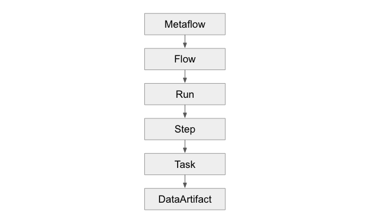

# Introduction
## Definition
Metaflow is a human-friendly Python library that makes it straightforward to develop, deploy, 
and operate various kinds of data-intensive applications, in particular those involving data science and ML.
Metaflow was originally developed at Netflix to boost the productivity of data scientists who work on a wide 
variety of projects, from classical statistics to state-of-the-art deep learning.

## Resources
- [Tutorials](https://github.com/Netflix/metaflow/tree/master/metaflow/tutorials)

# Flows
## Hierarchy
### Definition
The flows are organised in the following way:



Each object in the above hierarchy can be imported from the `metaflow` library, like `from metaflow import Run`.

### Accessing Flow Data
```python
# ---- List flows ----
from metaflow import Metaflow
print(Metaflow().flows)
# --------------------

# ---- List flow runs ----
from metaflow import Flow
flow = Flow('HelloFlow')

# Fetch the runs
for run in flow:
    print(run)
    
# Access a specific run
run = flow['2']
# -------------------

# ---- Access objects ----
from metaflow import Run, Step
run = Run('HelloFlow/2')
step = Step('HelloFlow/2/start')

# Access a DataArtifact
from metaflow import Step
print(Step('DebugFlow/2/a').task.data.x)
# -------------------
```

## Properties
The list of all object, flows, runs, steps and tasks properties can
be found in the [Metaflow Documentation](https://docs.metaflow.org/metaflow/client#common-properties).

```python
# -------- Tags --------
from metaflow import Run
run = Run('HelloFlow/2')

# List
print(Run('HelloFlow/2').system_tags)
print(Run('HelloFlow/2').tags)

# Adding
run.add_tag('one_tag') # add one tag
run.add_tags(['another_tag', 'yet_another', 'one_tag']) # add many tags

# Removing
run.remove_tag('one_tag') # remove one tag
run.remove_tags(['another_tag', 'yet_another']) # remove many tags

# Replacing
run.replace_tag('one_tag', 'better_tag')
run.replace_tags(['yet_another', 'another_tag'], ['better_tag'])
# ----------------------
```

## Steps
Execute the next step:

```python
@step
def join(self, inputs):
    print("Joining 🖇️")
    self.next(self.end)

@step
def end(self):
    print("Done! 🏁")
```
Execute two steps in parallel:

```python
import time
from metaflow import step, FlowSpec


class BranchFlow(FlowSpec):
    @step
    def start(self):
        print("Starting 👋")
        self.next(self.eat, self.drink)

    @step
    def eat(self):
        print("Pausing to eat... 🍜")
        time.sleep(10)
        self.next(self.join)

    @step
    def drink(self):
        print("Pausing to drink... 🥤")
        time.sleep(10)
        self.next(self.join)
```

 Loop steps:

 ```python
import time
from metaflow import step, FlowSpec


class ForeachFlow(FlowSpec):
    @step
    def start(self):
        self.data = ["Apple", "Orange"]
        self.next(self.process, foreach="data")

    @step
    def process(self):
        print("Processing:", self.input)
        self.fruit = self.input
        self.score = len(self.input)
        self.next(self.join)

    @step
    def join(self, inputs):
        print("Choosing the best fruit")
        self.best = max(inputs, key=lambda x: x.score).fruit
        print("Best fruit:", self.best)
        self.next(self.end)

    @step
    def end(self):
        pass


if __name__ == "__main__":
    ForeachFlow()
```

## Parameters

```python
from metaflow import FlowSpec, step, Parameter


class ParameterizedFlow(FlowSpec):

    learning_rate = Parameter('learning_rate',
                              help='Learning rate',
                              default=0.01)

    @step
    def start(self):
        self.next(self.end)

    @step
    def end(self):
        print("Learning rate value is {}".format(self.learning_rate))


if __name__ == "__main__":
    ParameterizedFlow()
```

Run the above like `python parameter_flow.py run --learning_rate 0.6`

## Docker Images
The decorator `@pypi_base` is used to freeze library dependencies for the entire flow:

```python
@pypi_base(packages={"datashader": "0.16.3", "pandas": "2.2.2", "pyarrow": "17.0.0"})
class NYCVizFlow(FlowSpec):
    pass
```

## Access Flows' Artifact
Create a Flow `ArtifactFlow`:
```python
from metaflow import FlowSpec, step


class ArtifactFlow(FlowSpec):
    @step
    def start(self):
        self.next(self.create_artifact)

    @step
    def create_artifact(self):
        self.dataset = [[1, 2, 3], [4, 5, 6], [7, 8, 9]]
        self.metadata_description = "created"
        self.next(self.transform_artifact)

    @step
    def transform_artifact(self):
        self.dataset = [[value * 10 for value in row] for row in self.dataset]
        self.metadata_description = "transformed"
        self.next(self.end)

    @step
    def end(self):
        print(
            "Artifact is in state `{}` with values {}".format(
                self.metadata_description, self.dataset
            )
        )


if __name__ == "__main__":
    ArtifactFlow()
```

Later on it's possible to access what was inside of it:
```python
from metaflow import Flow
run_artifacts = Flow("ArtifactFlow").latest_run.data
assert run_artifacts.dataset == [[10, 20, 30], [40, 50, 60], [70, 80, 90]]
```


# Visualising Results
## Card Decorator
They are used to add reports to the flow's step.

It creates a "Card" artifact inside the MetaFlow UI, in order to store more information for a specific task inside the Flow.

# Next
## Commands
```bash
# Show help
python flow.py help

# Show flow
python flow.py show

# Execute locally
python flow.py run
```
