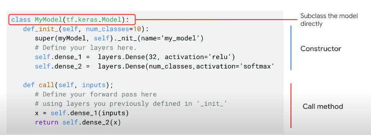

# Introduction
## Definition
TensorFlow is an open-source, high-performance library for numerical computation. It is especially useful for GPU computations, written in a high-level programming language like Python.
## DAG (Direct Acyclic Graphs)
The way TensorFlow works is that you create a directed graph, or a DAG, to represent the computation that you want to do. In this way, what matters for executing the TF code is only the DAG
representation. Thus it can be easily ported to different programming languages and hardware.
## TensorFlow Execution Engine
It executes the DAG based on the hardware underneath (CPU, GPU or TPU)
## API Architecture


## Speed Up Training
- Async Parameter Server - Some nodes act as parameter servers and other as workers. Each worker independently fetches the latest parameters from the PS and computes gradients based on a subset of training samples. It then sends the gradients back to the PS, which then updates its copy of the parameters with those gradients. Workers can get out of sync. Good when there are shallow devices on multiple hosts.
- Allreduce Parameter Server - Each worker holds a copy of the parameters and each worker computes the gradients. They then communicate between themselves the updated parameters. Workers are always in sync. Good when there are multiple devices on the same host.

## Model Parallelism
It is used when the model is too big to fit in one device. The training is divided between multiple devices, each of them working on the same dataset. Different devices can work on different parts of the model. Like for example, one device can work on the first layer, another on the second layer, etc.

# TensorFlow Tensors
## Constant vs Variables
The function `tf.constant([3, 2])` produces a Tensor of contanst that can not be modified.

On the other hand, `x = tf.Variable(2.0, dtype=tf.float32, name='my_variable` initialises a Tensor that can change value over time.
Very useful if you need, for example, have a Tensor of weights of a Neural Network.

The value of the Variable can be change through:
- `x.assign(3.0)`
- `x.assign_add(4.0)`
- etc.
# TensorFlow Data
## Definition
The module `tf.data` is a module to build efficient Data Pipeline of data preprocessing steps.
## Dataset Class
It represents a sequence of elements. It could represent, for example, a set of data points with the corresponding
labels.

# TensorFlow Model
## Sequential API
It allows to create a model that is composed by several sequential layers, with a single input/output.

### GRU RNN
```python
# Import Standard Libraries
from tensorflow.keras.layers import Embedding, GRU, Dense

# Define the model
model = Sequential(
  [
    Embedding(
      vocabulary_size + 1, 
      embeddings_dimension,
      input_shape=[sequence_max_length],
      mask_zero=True
    ),
    GRU(neuron_units),
    Dense(
      number_classes, 
      activation='softmax'
    )
])

# Compile the model
model.compile(
  optimizer='adam',
  loss='categorical_crossentropy',
  metrics=['accuracy']
)

# Fit the model
history = rnn_model.fit(
    X_train, 
    Y_train,
    epochs=numbero_epochs,
    batch_size=batch_size,
    validation_data=(X_valid, Y_valid),
    callbacks=[EarlyStopping(patience=patience_value), TensorBoard(model_directory)],
)

pd.DataFrame(history.history)[['loss', 'val_loss']].plot()
pd.DataFrame(history.history)[['accuracy', 'val_accuracy']].plot()
```

## Functional API
It allows to create an arbitrary model, not only a Sequential Model. It is however limited in customization.
That's why we want the Subclassing API.

## Subclassing API
Implements everything from scratch.
Like in the example below:


# TensorFlow Transform
## Definition
This API is dedicated to processing data for train, prediction and evaluation processes. It is strictly related to Apache Beam, which performs the so called *Analyze* phase, while TensorFlow Transform does the *Transformation* phase.
## PTransforms
These are two methods for *Analyze and Transform* a dataset:
- **AnalyzeAndTransformDataset** - It is executed in Beam to create a training dataset (like *fit_transform* in Scikit-Learn)
- **TransformDataset** - It is executed in Beam to create the evaluation dataset (like *transform* in Scikit-Learn)

Before you call the **AnalyzeAndTransformDataset** (Analyze phase), save the transformation function and then re-use it in the **TransformDataset** (Transform phase) to create the evaluation dataset.

# TensorFlow Data Validation
## Definition
It is a library for analyzing and validation ML data. Useful to analyze and validate continuous arriving data.
It is also used to detect distribution skew between training and serving data (training data is generated differently from how the data used to request predictions is generated).
It can also detect missing values, outliers, etc.
```python
import tensorflow_data_validation as tfdv
```
## Process
- The `ExampleGen` ingest raw data and output TensorFlow examples
- `StatisticsGen` it recieves the examples and generate statistics
  ```python
  # Read data as a Pandas DataFrame
  data = pd.read_csv('./<data.csv>')

  # Generate Statistics
  statistics = tfdv.generate_statistics_from_dataframe(dataframe=data)

  # Visualize Statistics
  tfdv.visualize_statistics(statistics)

  # Compare two Statistics
  tfdv.visualize_statistics(
    lhs_statistics=train_statistics, lhs_name='Train Dataset',
    rhs_statistics=test_statistics, rhs_name='Test Dataset')
  ```
- `SchemaGen` It can automatically generate a Data Schema from the Data Statistics
  ```python
  # Infer schema from statistics
  schema = tfdv.infer_schema(statistics=statistics)

  # Display schema
  tfdv.display_schema(schema=schema)
  ```
- `Example Validator` it allows you to check for anomalies between the Data Stastistics and the Data Schema
  ```python
  # Check for anomalies between the statistics and the schema
  anomalies = tfdv.validate_statistics(statistics=statistics, schema=schema)

  # Display the anomalies
  tfdv.display_anomalies(anomalies)
  ```

## Schema Environments
By default all datasets in a pipeline should use the same schema, but there are often exceptions. For example, in supervised learning we need to include labels in our dataset, but when we serve the model for inference the labels will not be included. In some cases introducing slight schema variations is necessary.

**Environments** can be used to express such requirements. In particular, features in schema can be associated with a set of environments using `default_environment`, `in_environment` and `not_in_environment`.

In the following example, the label `tips` would be excluded from the serving dataset.

```python
# All features are by default in both TRAINING and SERVING environments.
schema.default_environment.append('TRAINING')
schema.default_environment.append('SERVING')

# Specify that 'tips' feature is not in SERVING environment.
tfdv.get_feature(schema, 'tips').not_in_environment.append('SERVING')

serving_anomalies_with_env = tfdv.validate_statistics(
    serving_stats, schema, environment='SERVING')

tfdv.display_anomalies(serving_anomalies_with_env)
```

## Drift & Skew Detection
It is possible to setup thresholds for detecting drift & skew in the data:
```python
# Add skew comparator for 'payment_type' feature.
payment_type = tfdv.get_feature(schema, 'payment_type')
payment_type.skew_comparator.infinity_norm.threshold = 0.01

# Add drift comparator for 'company' feature.
company=tfdv.get_feature(schema, 'company')
company.drift_comparator.infinity_norm.threshold = 0.001

# TODO
skew_anomalies = tfdv.validate_statistics(train_stats, schema,
                                          previous_statistics=eval_stats,
                                          serving_statistics=serving_stats)

tfdv.display_anomalies(skew_anomalies)
```

## Store Schema
```python
from tensorflow.python.lib.io import file_io
from google.protobuf import text_format

file_io.recursive_create_dir(OUTPUT_DIR)
schema_file = os.path.join(OUTPUT_DIR, 'schema.pbtxt')
tfdv.write_schema_text(schema, schema_file)
```

# TensorFlow Distruted Strategies
## Definition
It is an API that takes care of distributed training.

## Strategies
There are four Data Parallelism Strategies:
- **Mirrored Strategy** - It creates a replica of the model on each GPU of the machine. Simplest solution. Each GPU is fed with different samples of the mini-batch.
  ```python
  # Create strategy
  strategy = tf.distribute.MirroredStrategy()

  with strategy.scope():

    # Create a Keras DNN
    model = create_model()

    # Compile the model
    model.compile(...)

    # Define the batch size
    batch_size = 64 * strategy.num_replicas_in_sync

    # Map, Shuffle and prefetch the data
    train_data = data['train'].map(preprocess_data)
    train_data = train_data.shuffle(1000)
    train_data = train_data.batch(batch_size)
    train_data = train_data.prefetch(tf.data.experimental.AUTOTUNE)

    # Model fit
    model.fit(train_data, epochs=5)
  ```
- **Multi-Worker Mirrored Strategy** - It just adds multiple machines to the above strategy.
  ```python
  # Define workers
  os.environ["TF_CONFIG"] = jsonì.dumps({
    "cluster": {
      "chief": ["host1:port"],
      "worker": ["host2:port", "host3:port"]
    },
    "task": {
      "type": "worker", 
      "index": 1}
  })

  # Create strategy
  strategy = tf.distribute.MultiWorkerMirroredStrategy()
  ```
  - **TPU Strategy** - A model is replicated in each CPU of a single machine.
    ```python
    # TPU Detection
    tpu = tf.distribute.cluster_resolver.TPUClusterResolver()
    tf.config.experimental_connect_to_cluster(tpu)
    tf.tpu.experimental.initialize_tpu_system(tpu)
    strategy = tf.distribute.experimental.TPUStrategy(tpu)
    ```
  - **Parameter Server Strategy** - It used a Parameter server to store model's parameters and workers to perform the training. A Coordinator (Cluster Resolver) is used to manage the synchronization of each elements.
  ```python
  strategy = tf.distribute.experimental.ParameterServerStrategy(
    tf.distribute.cluster_resolver.TFConfigClusterResolver()
  )
  ```

# TensorFlow Image
## Read Image
```python
# Read image as a tensor of bytes
image_bytes = tf.io.read_files(file_path)

# Decode image into uint8
image_uint8 = tf.image.decode_jpeg(image_bytes, channels=3)

# Convert image to RBG
image_rgb = tf.image.convert_image_dtype(image_uint8, tf.floar32)

# Resize image
image_resized = tf.image.resize(image_rgb, resize_dimensions)
```

# TensorFlow Text
## Tokenizer
```python
# Import Standard Library
from tensorflow.keras.preprocessing.text import Tokenizer

# Instance and fit the tokenizer
tokenizer = Tokenizer()
tokenizer.fit_on_texts(vocabulary)

# Transform text into sequence
sequence = tokenizer.texts_to_sequences(text)

# Retrieve vocabulary size
vocabulary_size = len(tokenizer.index_word)

# Retrieve dataset size
dataset_size = tokenizer.document_count
```