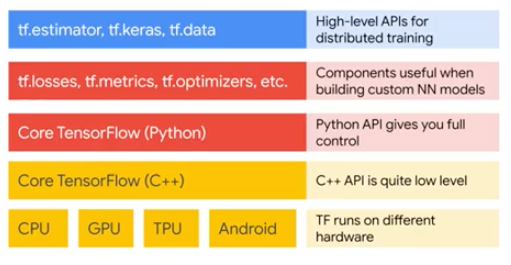

# Introduction
## Definition
TensorFlow is an open-source, high-performance library for numerical computation. It is especially useful for GPU computations, written in a high-level programming language like Python.
## DAG (Direct Acyclic Graphs)
The way TensorFlow works is that you create a directed graph, or a DAG, to represent the computation that you want to do. In this way, what matters for executing the TF code is only the DAG
representation. Thus it can be easily ported to different programming languages and hardware.
## TensorFlow Execution Engine
It executes the DAG based on the hardware underneath (CPU, GPU or TPU)
## API Architecture

