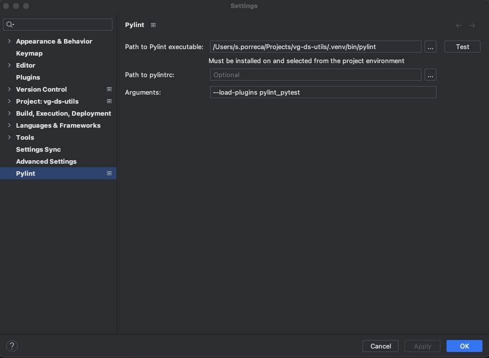

# Issues
## Pylint Compatibility
- It is required to add [pylint-pytest package](https://pypi.org/project/pylint-pytest/).
- Then configure pylint to use the plugin:
    ```bash
    pylint --load-plugins pylint_pytest
    ```
- Finally, configure PyCharm:
    
- 
