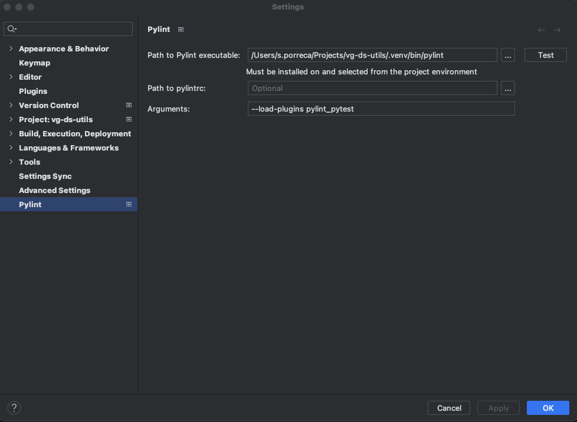

# Issues
## Pylint Compatibility
- It is required to add [pylint-pytest package](https://pypi.org/project/pylint-pytest/).
- Then configure pylint to use the plugin:
    ```bash
    pylint --load-plugins pylint_pytest
    ```
- Finally, configure PyCharm:
    

## Suppress Google Cloud Bigquery Warning
Add the following lines of code in the `pyproject.toml`
```toml
[tool.pytest.ini_options]
# Filter deprecation warning from google-cloud-bigquery
filterwarnings = [
    "ignore:Deprecated call to `pkg_resources\\.declare_namespace\\('.*'\\):DeprecationWarning",
    "ignore::DeprecationWarning:google.rpc",
]
pythonpath = [
  "src"
]
```

## .Env Variables
- Create a `.env` file in the root folder like
```
# Set environment variables
ROOT_PATH="/Users/user.fake/Projects/project_repo"
ANOTHER_VAR="Test Value"
```
- Install `poetry add pytest-dotenv`
- Modify the `pyproject.toml`
```
[tool.pytest.ini_options]
# Read from .env file
env_files = [".env"]
```

## Logs
```bash
-o log_cli=true --log-cli-level=DEBUG
```
