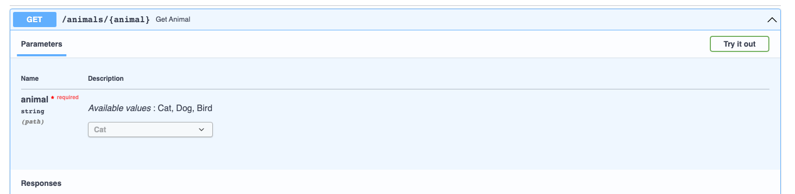

# Uvicorn

## Introduction
Uvicorn is an ASGI web server implementation for Python.
ASGI (Asynchronous Server Gateway Interface) is a spiritual successor to WSGI, 
intended to provide a standard interface between async-capable Python web servers, frameworks, and applications.

Where WSGI provided a standard for synchronous Python apps, ASGI provides one for both asynchronous and synchronous apps, 
with a WSGI backwards-compatibility implementation and multiple servers and application frameworks.

## Commands

### Start
``` shell
# The 'reload' flag allows to restart the service when a code update occurs
uvicorn <filename>:<fast_api_object> --reload

# Example
uvicorn first_api:service --reload
```

# FastAPI

## URLs
- [API](http://127.0.0.1:8000)
- [Interactive API Docs](http://127.0.0.1:8000/docs)
- [Alternative API Docs](http://127.0.0.1:8000/redoc)

## OpenAPI
FastAPI is able to generate an API schema through the OpenAPI standard in a JSON Schema `openapi.json`
``` json
{
    "openapi": "3.0.2",
    "info": {
        "title": "FastAPI",
        "version": "0.1.0"
    },
    "paths": {
        "/items/": {
            "get": {
                "responses": {
                    "200": {
                        "description": "Successful Response",
                        "content": {
                            "application/json": {


...
```

The `openapi.json` schema generated is what power the two interactive documentation.

## Path Parameters

### Schema Validation
If the parameter's type is specified within the function's argument, FastAPI performs automatically the type
validation upon receiving the request.
``` python
@service.get('/items/{item_id}')
async def get_item(item_id: int):

    return {'item': item_id}
```

Querying with a URL like `http://127.0.0.1:8000/items/ciao` would through a ValidationError:
``` json
{"detail":
    [
        {"loc": ["path", "item_id"],
          "msg": "value is not a valid integer",
          "type":"type_error.integer"}
    ]
}
```

### Path Orders
It is important to respect a certain order of the paths declared.

``` python
from fastapi import FastAPI

app = FastAPI()


@app.get("/users/me")
async def read_user_me():
    return {"user_id": "the current user"}


@app.get("/users/{user_id}")
async def read_user(user_id: str):
    return {"user_id": user_id}
```

If `/users/{user_id}` would have been declared before `/users/me`, the value "me" could also match a user_id.

### Path Enum
It enforces the path parameters to only accept specific values:
``` python
# Import Standard Libraries
from fastapi import FastAPI
from enum import Enum


class Animal(str, Enum):
    """
    Define a class holding possible values for the 'animal' path parameter. No other values would be accepted
    """

    cat = 'Cat'
    dog = 'Dog'
    bird = 'Bird'


# Instantiate FastAPI
app = FastAPI()


@app.get('/animals/{animal}')
async def get_animal(animal: Animal):

    match animal:
        case Animal.cat:
            return {'animal': animal, 'message': 'You are looking for a cat'}
        case Animal.dog:
            return {'animal': animal, 'message': 'You are looking for a dog'}
        case Animal.bird:
            return {'animal': animal, 'message': 'You are looking for a bird'}
```
